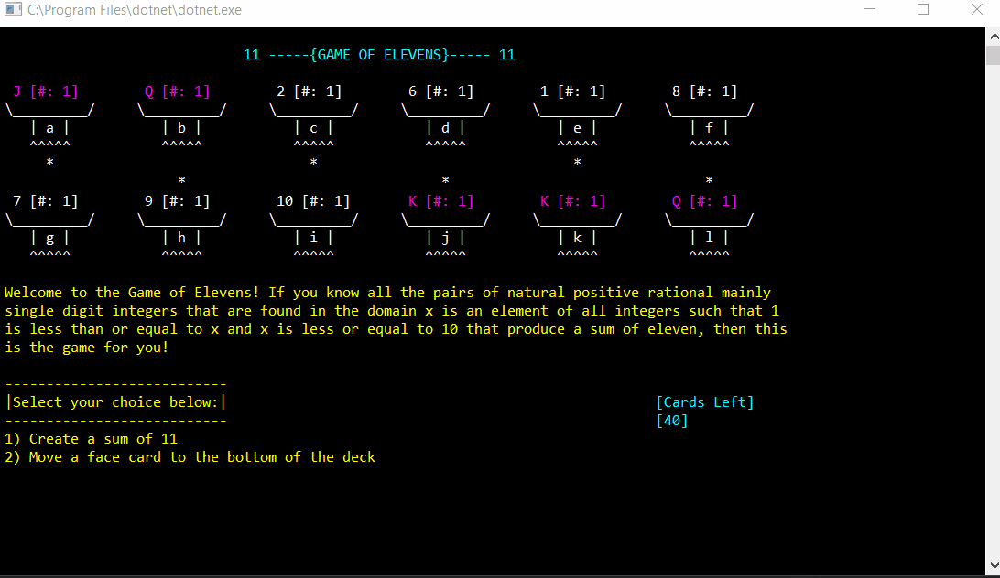

# game_of_elevens

Game of Elevens, a console game created in C#, is a card game where the user's goal is to have face cards on all piles by either selecting two cards adding up to eleven or selecting a pile with a single face card to move to the bottom of the deck, as shown:

